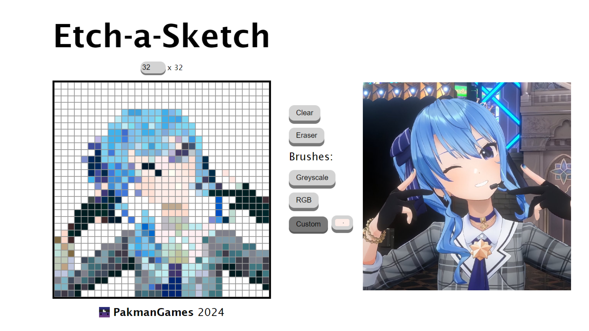

# etch-a-sketch
This is an etch-a-sketch drawing board.

- This project utilizes flexbox, DOM manipulation, and event listeners for an interactive drawing board. It includes a dynamically updating grid size and tool buttons, including a custom color tool.

Click
<a href="https://pakmangames.github.io/etch-a-sketch/" target="_blank">here</a>
to try drawing for yourself!

Here's what you can draw (reference image to the right)

